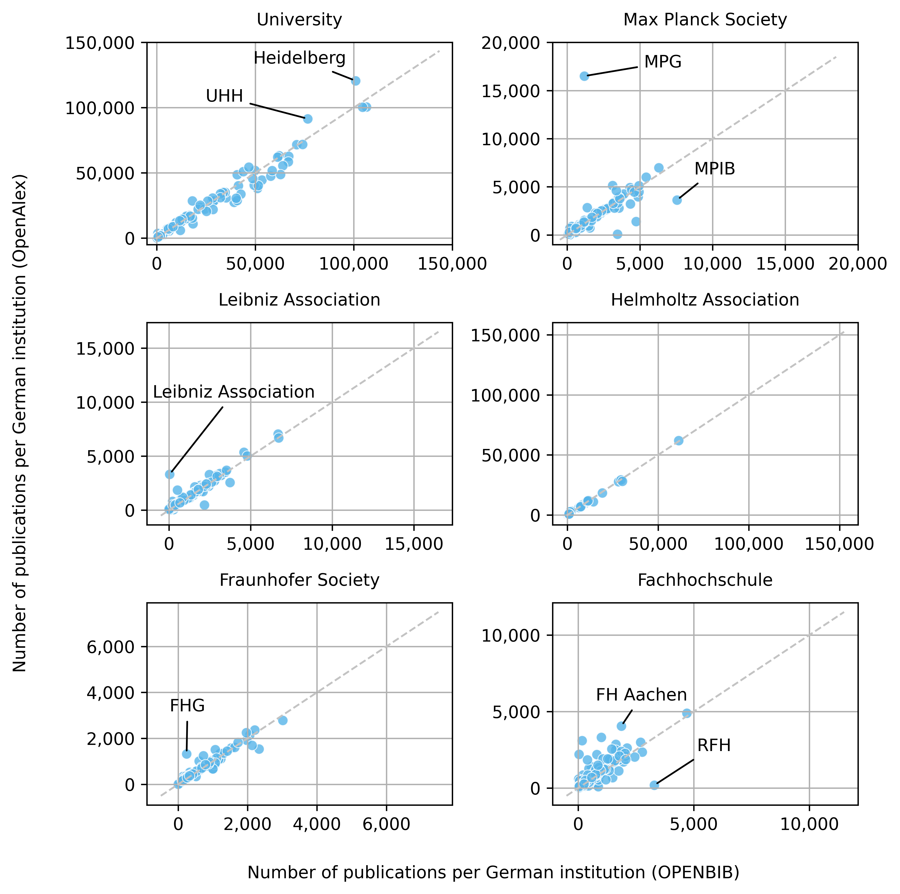
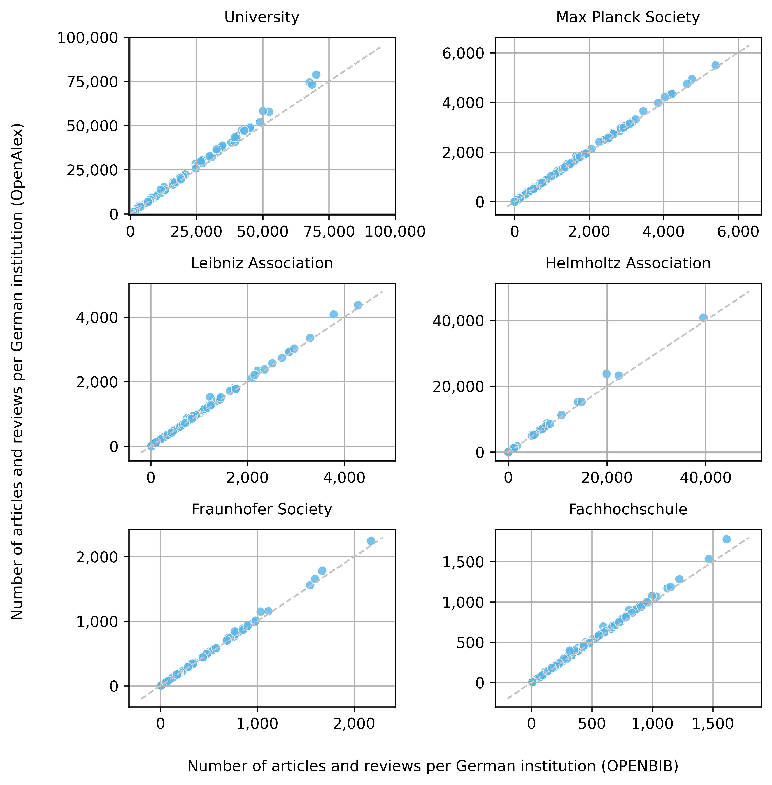
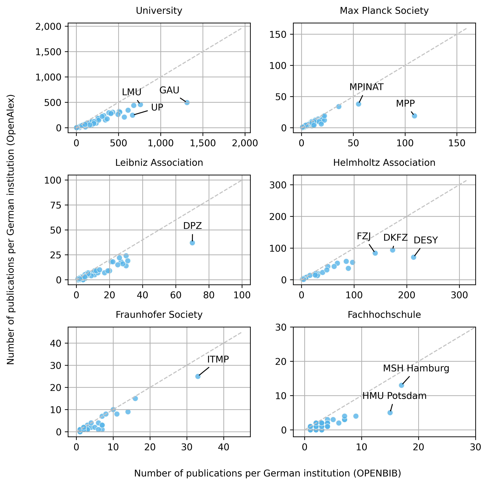

# OPENBIB: Selected curated open metadata based on OpenAlex


## About

The OPENBIB project, maintained by the German [Kompetenznetzwerk Bibliometrie](https://bibliometrie.info),  
provides access to curated OpenAlex data with a focus on the German research landscape.

Curated data is provided for following entities: 

- [Address information](docs/data_overview.md#-address-information) 🏛️
- [Publishers](docs/data_overview.md#-publishers) 📚
- [Funding information](docs/data_overview.md#-funding-information) 📄
- [Document types](docs/data_overview.md#-document-types) 🗂️
- [Transformative Agreements](docs/data_overview.md#-transformative-agreements) 📑️
- [Authors](docs/data_overview.md#-authors) 👩‍🎓 (tba)

Annual snapshots from the OPENBIB project are openly available to users of the 
[Kompetenznetzwerk Bibliometrie](https://bibliometrie.info), via the 
[Open Scholarly Data Warehouse of the SUB Göttingen](https://subugoe.github.io/scholcomm_analytics/data.html)
and [Zenodo](https://zenodo.org).

The current release is based on the August 2024 snapshot of OpenAlex. The OPENBIB snapshot 
is offered in both CSV and JSONL format.

## Usage

### Address information

The following figure compares the assignment of publications to German institutions
in OpenAlex and in OPENBIB. The figure includes publications between 2014 and 
2024, but is not restricted to specific document or publication types. While OpenAlex 
combines rule-based and machine learning algorithms to match address affiliations in 
documents with institutions, OPENBIB applies a pattern matching approach. The figure 
only displays institutions that are present in both OpenAlex and OPENBIB and can be 
assigned a unique Research Organisation Registry (ROR) ID. 

<figure>
    
    <figcaption>
        <b>Fig.1:</b> Publications assigned to German institutions in OpenAlex and OPENBIB based on ROR-Matching. Only publications published between 2014 and 2024 are considered.
    </figcaption>
</figure>

### Document types

The following figure compares the classification of article and reviews in OpenAlex
and in OPENBIB, limited to the publication years 2014 to 2024. OpenAlex counts more 
article and reviews than OPENBIB because the OPENBIB classifier is stricter when 
classifying research contributions. Articles and reviews are assigned to German 
institutions exclusively via OPENBIB address information. 

<figure>
    
    <figcaption>
        <b>Fig.2:</b> Classification of article and reviews in journals for German institutions in OpenAlex and by OPENBIB. Only publications published between 2014 and 2024 are considered.
    </figcaption>
</figure>

### Funding information

The following figure compares the number of publications with funding
information of the German Research Foundation in OpenAlex and in OPENBIB. 
Only publications funded by the German 
[Open-Access-Publikationskosten](https://www.dfg.de/en/research-funding/funding-opportunities/programmes/infrastructure/lis/funding-opportunities/open-access-publication-funding) 
program are considered. Publications are assigned to German institutions exclusively 
via OPENBIB address information. No restrictions were placed on the type of documents or 
publications, however most of the records are journal articles.

<figure>
    
    <figcaption>
        <b>Fig.3:</b> Publications containing funding information of the German Research Foundation per German institution in OpenAlex and by OPENBIB. Only publications published between 2020 and 2024 are considered. 
    </figcaption>
</figure>

## How do I get it?

- If you are a user of the [Kompetenznetzwerk Bibliometrie](https://bibliometrie.info)
you can access the data snapshot via the KB data infrastructure hosted by FIZ Karlsruhe.

- For big scholarly data analysis in a Google Cloud environment, you can use the 
[Open Scholarly Data Warehouse](https://subugoe.github.io/scholcomm_analytics/data.html)
maintained by the SUB Göttingen.

- Alternatively, you can download the snapshot from Zenodo: https://zenodo.org. 

## Technical Documentation

A list of all entities and fields included in the OPENBIB snapshot can be found
[here](docs/data_overview.md).

### Jupyter notebooks
- A jupyter notebook containing code examples for working with the OPENBIB snapshot in the KB data infrastructure can be 
found [here](examples/kb_notebook.ipynb).
- A jupyter notebook containing code examples for working with the OPENBIB snapshot in the Open Scholarly 
Data Warehouse of the SUB Göttingen can be found [here](examples/bigquery_notebook.ipynb).

### How to export a snapshot

To export a complete OPENBIB snapshot from the KB database, use the
following code. A VPN connection to FIZ Karlsruhe is required to access the database.

```python
from scripts.export_files import OpenBibDataRelease

openbib_snapshot = OpenBibDataRelease(
    export_directory='openbib_export',
    export_file_name='kbopenbib_release',
    host='host',
    database='database',
    port='port',
    user='user',
    password='password'
)

openbib_snapshot.make_archive(export_format='csv')
```

## How can I get involved?

If you see mistakes, want to suggest changes or submit feature requests, please 
[create an issue](https://github.com/kbopenbib/kbopenbib_data/issues).

## License

Data is made available under the [CC0 license](LICENSE.txt).

## Citation

## Contact


