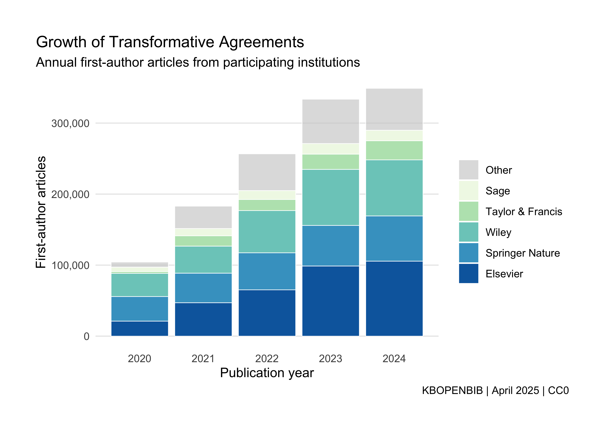
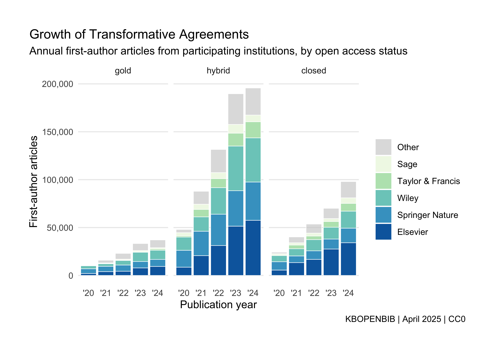

# Transformative Agreements Dataset

## Overview

This dataset preserves historical records of the [public Transformative
Agreement Data
dumps](https://journalcheckertool.org/transformative-agreements/) as
provided by the [Journal Checker Tool](https://journalcheckertool.org/)
from the [cOAlition S](https://www.coalition-s.org/) since July 2021. By
linking agreement data with OpenAlex and using standardised identifiers
(ISSN-L for journals, ROR-IDs for institutions), it enables open data
analyses on these agreements’ evolution and impact over time.

Overall, this dataset comprises:

- 1,043 transformative agreements with data about 17,199 eligible
  journals and 5,355 participating institutions.
- 1,362,221 eligible articles published by first authors affiliated with
  participating institutions.

## Motivation

Quantitative science studies are increasingly examining the impact of
transformative agreements on scholarly publishing. As transformative
agreements have also become a much debated licensing model for
libraries, measuring their extent is also high on the policy agenda.
Unfortunately, information on this licensing model is only partially
available and scattered across different open data sources.

For example, the [public Transformative Agreement Data
dumps](https://journalcheckertool.org/transformative-agreements/) as
provided by the [Journal Checker Tool](https://journalcheckertool.org/)
from the [cOAlition S](https://www.coalition-s.org/) (JCT), which is the
most comprehensive source for journals and institutions covered by
transformative agreements, provides data only for current agreements;
information about expired agreements is not available, limiting
longitudinal studies.

To address this data gap, this dataset combines open data from different
sources to improve the transparency of transformative agreements and to
allow estimates about articles published under these agreements. It uses
JCT transformative agreement data for information on journal portfolios
and participating institutions. The data were normalised using ISSN-L
for journals (as provided by the ISSN Agency) and associated ROR-IDs (as
provided by OpenAlex). Due to limited public invoicing data, articles
published under transformative agreements were identified by linking
first author affiliations from OpenAlex to eligible institutions
according to agreement data.

As such, the dataset aims to support data-driven research and monitoring
of open access business models and transformative agreements using open
data and methods.

## Methods

### Data retrieval

A dedicated [bot](https://github.com/njahn82/jct_data/) has been
fetching the cOAlition S Public Transformative Agreement Data dump
serving the Journal Checker Tool weekly since December 2022. The
resulting data snapshots were saved using Git and are available via
[GitHub](https://github.com/njahn82/jct_data?tab=readme-ov-file#snapshots).
To create a comprehensive dataset, the weekly snapshots were retrieved
from git and merged together using a custom
[script](https://github.com/njahn82/jct_data/blob/main/combine.R)). As
the Transformative Agreement Data are continuously curated, only the
most recent data about an agreement were safeguarded. For expired
agreements, this represented the latest snapshot available.

### Data curation

The cOAlition S Public Transformative Agreement Data dumps link
agreements to journals represented by journal names and ISSN. After
mapping ISSN variants to the corresponding linking ISSN (ISSN-L), as
provided by the ISSN International Centre, journals were associated with
publishers according to the [ESAC Transformative Agreement
Registry](https://esac-initiative.org/about/transformative-agreements/agreement-registry/).
This reflects that some portfolios may include imprints.

cOAlition S Public Transformative Agreement Data did not comprehensively
cover associated institutions, such as university hospitals or
institutes of large research organisations like the Max Planck Society.
To improve matching, cOAlition S Public Transformative Agreement Data
were automatically enriched with ROR-IDs from associated organisations
according to OpenAlex’s institution entity data.

To estimate articles enabled by transformative agreements, article
metadata were retrieved for each journal from OpenAlex. Then,
participating institutions were matched with the first author
affiliations recorded by OpenAlex. The matching considered first author
affiliations instead of corresponding author affiliation due to the lack
of corresponding author data in OpenAlex. Matching also considered the
duration of agreements according to the [ESAC
registry](https://esac-initiative.org/about/transformative-agreements/agreement-registry/).

The matching was carried out on [Google
BigQuery](https://console.cloud.google.com/bigquery) for performance
reasons.

The compilation of the datasets was carried out in April 2025 using the
most recent datasets.

## Data files

The dataset consists of four files:

**Historic cOAlition S Transformative Agreement Data**

- `jct_journals` links journals (represented by ISSN-L) to
  transformative agreements (represented by ESAC ID)
- `jct_institutions` links participating institutions (represented by
  ROR-ID) to transformative agreements (represented by ESAC ID)

**ESAC snapshot**

- `jct_esac` - Metadata about the transformative agreements from the
  ESAC registry, in particular publisher name and duration of agreement

**Articles under Transformative Agreements**

- `jct_articles` links articles indexed in OpenAlex to transformative
  agreements through matching with `jct_journals` (by ISSN-L),
  `jct_institutions` (by ROR-ID representing first-author afilliation)
  and `jct_esac` (by ESAC ID and duration of agreement)

You can find the documentation of data files in the [data
documentation](data_overview.md#-transformative-agreements)

## Use case

### How many articles were enabled by transformative agreements?

The following SQL query shows how to retrieve annual counts for articles
enabled by transformative agreements. Using `jct_articles` as a starting
point, retrieval is restricted to articles and reviews according to
OpenAlex. Furthermore, articles were matched to publishers according to
the ESAC registry.

``` sql
SELECT
  publication_year,
  esac.publisher,
  COUNT(DISTINCT(jct.id)) AS n,
FROM
  `subugoe-collaborative.openbib.jct_articles` AS jct
INNER JOIN
  `subugoe-collaborative.openalex.works` AS oalex
ON
  oalex.doi = jct.doi
INNER JOIN
  `subugoe-collaborative.openbib.jct_esac` AS esac
ON
  esac.id = jct.esac_id
WHERE oalex.type IN ('article', 'review') AND is_paratext = FALSE
GROUP BY
  publication_year,
  publisher
ORDER BY
  publication_year DESC,
  n DESC
```

``` r
bq_df
#> # A tibble: 292 × 3
#>    publication_year publisher                      n
#>               <int> <chr>                      <int>
#>  1             2025 Wiley                      13741
#>  2             2025 Elsevier                   11194
#>  3             2025 Springer Nature             7930
#>  4             2025 Taylor & Francis            6035
#>  5             2025 Sage                        3194
#>  6             2025 Oxford University Press     2700
#>  7             2025 American Chemical Society   1202
#>  8             2025 Royal Society of Chemistry   697
#>  9             2025 American Physical Society    581
#> 10             2025 Cambridge University Press   548
#> # ℹ 282 more rows
```

<div id="fig-all">



Figure 1: Growth of articles enabled by transformative agreements
between 2020 and 2024, showing the dominance of the five largest
commercial publishers in the scholarly publishing market.

</div>

Figure 1 shows the growth of articles enabled by transformative
agreements between 2020 and 2024. It furthermore highlights the
dominance of the five large commercial publishers, with Elsevier,
Springer Nature and Wiley leading.

### How many articles were made open access by transformative agreements?

Transformative agreements are complex. For instance, journal bundles can
include full open access journals, hybrid journals and subscription
journals. Furthermore, not all document types are allowed. Sometimes
agreements also cap the number of articles that can be made open access.
Additionally, authors can opt out of open access publication.

Therefore, additional open access evidence is needed in order to
estimate the number of open access articles enabled by transformative
agreements. The following SQL shows that article-level open access
status information from OpenAlex was added.

``` sql
SELECT
  publication_year,
  esac.publisher,
  oalex.open_access.oa_status,
  COUNT(DISTINCT(jct.id)) AS n,
FROM
  `subugoe-collaborative.openbib.jct_articles` AS jct
INNER JOIN
  `subugoe-collaborative.openalex.works` AS oalex
ON
  oalex.doi = jct.doi
INNER JOIN
  `subugoe-collaborative.openbib.jct_esac` AS esac
ON
  esac.id = jct.esac_id
WHERE oalex.type IN ('article', 'review') AND is_paratext = FALSE
GROUP BY
  publication_year,
  publisher, 
  oalex.open_access.oa_status
ORDER BY
  publication_year DESC,
  n DESC
```

``` r
bq_oa_df
#> # A tibble: 1,243 × 4
#>    publication_year publisher        oa_status     n
#>               <int> <chr>            <chr>     <int>
#>  1             2025 Wiley            hybrid     7761
#>  2             2025 Elsevier         hybrid     5417
#>  3             2025 Springer Nature  hybrid     4682
#>  4             2025 Elsevier         closed     4491
#>  5             2025 Taylor & Francis hybrid     3597
#>  6             2025 Wiley            closed     3326
#>  7             2025 Sage             closed     2495
#>  8             2025 Wiley            gold       2188
#>  9             2025 Taylor & Francis closed     2110
#> 10             2025 Springer Nature  gold       1562
#> # ℹ 1,233 more rows
```

<div id="fig-oa">



Figure 2: Articles covered by transformative agreements by open access
status

</div>

Figure 2 shows open access by business model, highlighting that the
majority of articles was made available in hybrid journals. But also the
number of closed articles is striking. These can not only signal
shortcomings in the matching, but also complexities of transformative
agreements in general with regard to journal inclusion, article caps and
the restriction of some document types. Also authors can opt out of open
access.

## Responsible use

It is important to note that the [public Transformative Agreement Data
dumps](https://journalcheckertool.org/transformative-agreements/) as
provided by the [Journal Checker Tool](https://journalcheckertool.org/)
from the [cOAlition S](https://www.coalition-s.org/) and the ESAC
Registry are voluntary, crowd-sourcing efforts. Information is therefore
always subject to change.

Because of a lack of publicly available invoicing data, the provided
list of articles enabled by transformative agreements represents only
estimates. These estimates are based on first-author affiliations
according to OpenAlex. Note that, transformative agreement guidelines
require data about corresponding authors, an information, which is still
not fully avaialble in OpenAlex. However, a [strong alignment between
first and corresponding authorship can be
observed](https://arxiv.org/abs/2504.15038v1).

## Further reading

For an coverage analysis between Scopus, Web of Science and open
metadata with a specific focus on hybrid journals in transformative
agreements, see:

Jahn, N. (2025). *Estimating transformative agreement impact on hybrid
open access: A comparative large-scale study using Scopus, Web of
Science and open metadata*. arXiv. <https://arxiv.org/abs/2504.15038>

For a validation study using internal research information, see:

de Jonge, H., Kramer, B., & Sondervan, J. (2025). *Tracking
transformative agreements through open metadata: Method and validation
using Dutch Research Council NWO funded papers*. MetaArXiv.
<https://doi.org/10.31222/osf.io/tz6be_v1>

For an analysis of hybrid open access through transformative agreements
using this data approach, see:

Jahn, N. (2025). How open are hybrid journals included in transformative
agreements? *Quantitative Science Studies*, 6, 242–262.
<https://doi.org/10.1162/qss_a_00348>

For an overview about the transpareny of open access infrastructures,
see:

Kramer, B. (2024). *Study on scientific publishing in Europe:
Development, diversity, and transparency of costs*. Publications Office
of the European Union. <https://doi.org/10.2777/89349>

For an analysis of the ESAC registry, see:

Rothfritz, L., Schmal, W. B., & Herb, U. (2024). *Trapped in
transformative agreements? A multifaceted analysis of \>1,000
contracts*. arXiv. https://arxiv.org/abs/2409.20224

For an overview of transformative agreement from the perspective of
library consortia, see:

Dér, Á. (2025). What gets missed in the discourse on transformative
agreements. *Katina Magazine*. https://doi.org/10.1146/katina-20250212-1

For economic discussion of transformative agreements, see:

Haucap, J., Moshgbar, N., & Schmal, W. B. (2021). The impact of the
German “DEAL” on competition in the academic publishing market.
*Managerial and Decision Economics*, 42(8), 2027–2049.
<https://doi.org/10.1002/mde.3493>

McCabe, M. J., & Mueller-Langer, F. (2024). Open access is shaping
scientific communication. *Science*, 385(6714), 1170–1172.
<https://doi.org/10.1126/science.adp8882>

## Contact

In case of questions and issues, please contact [Najko
Jahn](mailto:najko.jahn@sub.uni-goettingen.de), SUB Göttingen.

## License

CCO
